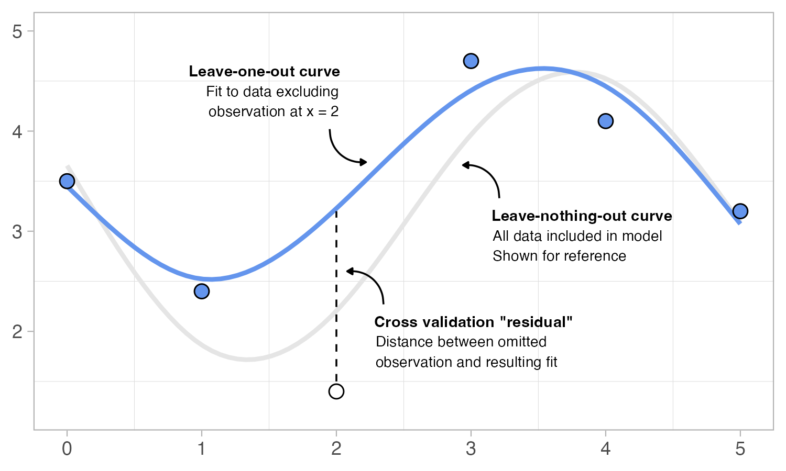

Having established linear and multiple regression from the ground up in earlier sessions, we now extend these concepts to model *non-linear relationships*.

Before continuing with the exercises below, you should first work through the accompanying interactive tutorial on [Generalized Additive Models (GAMs)](https://haswal.quarto.pub/intro-to-gams/){target="_blank"}. This tutorial is designed to help you *build intuition* for the mechanics of spline-based models. Work interactively with the examples, change parameters and observe what happens.

To help reinforce your understanding of non-linear modelling, we will work through a series of exercises using simulated data. Download the dataset by clicking the button below and load it into R.

```{r}
#| echo: false
#| message: false
#| warning: false

library(tidyverse)
library(downloadthis)

set.seed(123)

n <- 120

age_in_months <- runif(n, 0, 24)
#age_in_months <- seq(0, 24, length.out = n)

alpha <- 10    
beta  <- 0.25  
gamma <- 6  

true_score <- ifelse(age_in_months < gamma,
                     0,
                     alpha * (1 - exp(-beta * (age_in_months - gamma))))

y <- true_score + rnorm(n, mean = 0, sd = 0.8)

y <- (y - min(y)) / (max(y) - min(y)) * 10

df_1_nl <- tibble(age_in_months = age_in_months,
              developmental_score = y)

df_1_nl %>% 
  download_this(
    output_name = "df_1_nl",
    output_extension = ".csv",
    button_label = "Download df_1_nl as csv",
    button_type = "default",
    has_icon = TRUE,
    icon = "fa fa-save",
    csv2 = FALSE
  )
```

<p style="margin:30px;">

In previous sessions, we used regression models to describe relationships between variables and make predictions. It is also important to assess how well a model captures the observed data. One way to do this is by examining the residuals. If a model fits the data well, the residuals should appear as a random cloud of points around zero, without any obvious pattern or remaining structure.

1.  Fit a simple linear regression model using the `df_1_nl` data, predicting `developmental_score` from `age_in_months`. Once you have fitted the model, calculate the predicted values and residuals. Then create two figures:

-   A scatter plot showing the relationship between `developmental_score` and `age_in_months`, together with the fitted regression line.

-   A scatter plot showing the model's predicted values on the x-axis and residuals on the y-axis. Add a horizontal reference line at zero.

    Study both figures before continuing. How well does the regression line appear to capture the relationship between `age_in_months` and `developmental_score`? When examining the residual plot, do you notice any visible structure?

A linear regression model assumes that the relationship between variables can be described by a straight line, with a constant change in the outcome across all values of the predictor. For the `df_1_nl` data, this assumption may be too restrictive. By allowing the relationship to bend and change smoothly, we can model non linear patterns while still using a regression framework.

One way to build more flexible regression models is to combine a set of simple functions, called *basis functions*. Each basis function captures part of the relationship, and together they form the overall fitted curve. A common and powerful approach is to use *B-splines*, which provide a structured way to construct these functions. In R, B-splines can be created using the `bs()` function from the `splines` package. The code below generates B-spline basis functions evaluated across `age_in_months` in `df_1_nl`.

```{r}
#| eval: false
bs(df_1_nl |> pull(age_in_months), df = 4, intercept = TRUE) |> 
  as_tibble() |> 
  rename_with(\(i) paste0("bf", i), everything()) |> 
  add_column(age_in_months = df_1_nl |> pull(age_in_months))
```

The `bs()` function returns a matrix where each column represents a basis function. Here, `df = 4` together with `intercept = TRUE` generates four basis functions. The output is converted to a tibble using `as_tibble()`, the basis-function columns are renamed (`bf1`–`bf4`), and `age_in_months` is added back in so that the basis functions can be plotted against age.

2.  The figure below shows four B-spline basis functions generated across the age range in `df_1_nl`. Reproduce this figure. A bit of pivoting might be useful.

```{r}
#| echo: false
#| warning: false
#| fig-align: center
#| fig-height: 3.5
#| fig-width: 6
library(splines)
bs(df_1_nl |> pull(age_in_months), df = 4, intercept = TRUE) |> 
  as_tibble() |> 
  rename_with(\(i) paste0("bf", i), everything()) |> 
  add_column(age_in_months = df_1_nl |> pull(age_in_months)) |> 
  pivot_longer(cols = 1:4, 
               names_to = "basis_function") |> 
  ggplot(aes(x = age_in_months, y = value, colour = basis_function)) +
  geom_line(linewidth = 0.8) +
  labs(color = NULL,
       y = NULL) +
  theme_minimal(base_size = 14)
```

We can combine basis functions by assigning each one a *weight* (that is, multiplying each basis function by a number) and then summing them together. The resulting function can be written as:

$$ f(x) = w_1bf_1 + w_2bf_2 + w_3bf_3 + w_4bf_4 $$

where $bf_1–bf_4$ are the basis functions and $w_1–w_4$ are weights controlling how much each basis function contributes to the final curve. Changing these weights changes the shape of $f(x)$.

3.  The figure below shows several weighted combinations of the same four basis functions. Recreate the code used to make this plot. Use `mutate()` to generate weighted combinations of the basis functions and sum these to calculate $f(x)$ (the black curves/lines in the plot). Once you have reproduced the figure, spend a moment comparing how different combinations of $w_1–w_4$ change the shape of the resulting smooth functions.

```{r}
#| echo: false
#| warning: false
#| fig-align: center
#| fig-height: 5.5
#| fig-width: 9

basis <- bs(df_1_nl |> pull(age_in_months), df = 4, intercept = TRUE) |> 
  as_tibble() |> 
  rename_with(\(i) paste0("bf", i), everything()) |> 
  add_column(age_in_months = df_1_nl |> pull(age_in_months))

basis |> 
  mutate(w1bf1 = bf1 * 1,
         w2bf2 = bf2 * 1,
         w3bf3 = bf3 * 1,
         w4bf4 = bf4 * 1,
         fx = w1bf1 + w2bf2 + w3bf3 + w4bf4) |> 
  pivot_longer(w1bf1:w4bf4,
               names_to = "basis") |> 
  mutate(params = "w1 = 1, w2 = 1, w3 = 1, w4 = 1") |> 
  add_row(basis |> 
            mutate(w1bf1 = bf1 * 0.5,
                   w2bf2 = bf2 * -0.9,
                   w3bf3 = bf3 * 0.1,
                   w4bf4 = bf4 * -0.6,
                   fx = w1bf1 + w2bf2 + w3bf3 + w4bf4) |> 
            pivot_longer(w1bf1:w4bf4,
                         names_to = "basis") |> 
            mutate(params = "w1 = 0.5, w2 = -0.9, w3 = 0.1, w4 = -0.6")) |> 
  add_row(basis |> 
            mutate(w1bf1 = bf1 * -0.5,
                   w2bf2 = bf2 * 2,
                   w3bf3 = bf3 * -2,
                   w4bf4 = bf4 * 0.9,
                   fx = w1bf1 + w2bf2 + w3bf3 + w4bf4) |> 
            pivot_longer(w1bf1:w4bf4,
                         names_to = "basis") |> 
            mutate(params = "w1 = -0.5, w2 = 2, w3 = -2, w4 = 0.9")) |> 
  add_row(basis |> 
            mutate(w1bf1 = bf1 * 2,
                   w2bf2 = bf2 * 1,
                   w3bf3 = bf3 * 0,
                   w4bf4 = bf4 * -1,
                   fx = w1bf1 + w2bf2 + w3bf3 + w4bf4) |> 
            pivot_longer(w1bf1:w4bf4,
                         names_to = "basis") |> 
            mutate(params = "w1 = 2, w2 = 1, w3 = 0, w4 = -1")) |> 
  ggplot(aes(x = age_in_months, y = fx)) +
  geom_line(aes(x = age_in_months, y = value, color = basis)) +
  geom_line(linewidth = 1) +
  theme_bw(base_size = 14) +
  labs(color = NULL,
       y = NULL) +
  facet_wrap(~params, ncol = 2, scale = "free_y")

```

So far we have combined basis functions using manually chosen weights. In practice, however, we usually want to find the combination of weights that best captures some observed data. This can be viewed as a regression problem. As in previous regression sessions, we can search for the set of weights that minimizes the residual sum of squares (RSS). Rather than searching for the slope and intercept of a straight line, we now search for the weights assigned to each basis function.

4.  We will now return to the `df_1_nl` dataset and apply the idea outlined above. Instead of using `age_in_months` directly, we first transform it into a set of B-spline basis functions, which will serve as predictors in the model. The goal is to estimate weights for these basis functions so that their combined effect best matches the observed data. Modify your `rss()` function from previous sessions so that predictions are obtained by taking a weighted sum of four B-spline basis functions, with the weights playing the same role as slope coefficients in a linear model. Use a random search procedure, as in the multiple regression session, to find a set of weights that approximately minimize the RSS. You may find it helpful to search adaptively by starting with wide ranges and then narrowing the search as you learn which values produce lower RSS.

-   Calculate predicted values (as in $f(x)$ above).

-   Plot predicted values against `age_in_months` together with the observed data.

-   Evaluate if the predicted curve fits the data well.

Of course, instead of searching for good weights manually, we can fit the model directly using `lm()`. The code would look like this:

```{r}
#| eval: false
lm(developmental_score ~ -1 + bf1 + bf2 + bf3 + bf4, data = df_1_nl_bs)
```

The `-1` removes the intercept from the model. This is important here because the basis functions already form a complete representation of the function space, so we do not need an additional intercept term.

5.  In this exercise you will fit spline models using `lm()` and compare how the flexibility of the model changes with the number of basis functions. To recreate the plot below, you will need to generate different numbers of B-spline basis functions using `bs()`, fit linear models using `lm()` with the basis functions as predictors, calculate predicted values either by hand or using `predict()`, and finally plot predicted values against `age_in_months` together with the observed data.

```{r}
#| echo: false
#| warning: false
#| fig-align: center
#| fig-height: 5.5
#| fig-width: 7.5

bf4 <- bs(df_1_nl |> pull(age_in_months), df = 4, intercept = TRUE) |> 
  as_tibble() |> 
  rename_with(\(i) paste0("bf", i), everything()) |> 
  add_column(age_in_months = df_1_nl |> pull(age_in_months)) |> 
  add_column(ds = df_1_nl |> pull(developmental_score))

fit4 <- lm(ds ~ -1 + bf1 + bf2 + bf3 + bf4, data = bf4)

bf8 <- bs(df_1_nl |> pull(age_in_months), df = 8, intercept = TRUE) |> 
  as_tibble() |> 
  rename_with(\(i) paste0("bf", i), everything()) |> 
  add_column(ds = df_1_nl |> pull(developmental_score))

fit8 <- lm(ds ~ -1 + bf1 + bf2 + bf3 + bf4 + bf5 + bf6 + + bf7 + bf8, data = bf8)

bf12 <- bs(df_1_nl |> pull(age_in_months), df = 12, intercept = TRUE) |> 
  as_tibble() |> 
  rename_with(\(i) paste0("bf", i), everything()) |> 
  add_column(ds = df_1_nl |> pull(developmental_score))

fit12 <- lm(ds ~ -1 + bf1 + bf2 + bf3 + bf4 + bf5 + bf6 + bf7 + bf8 + 
              bf9 + bf10 + bf11 + bf12, data = bf12)

bf16 <- bs(df_1_nl |> pull(age_in_months), df = 16, intercept = TRUE) |> 
  as_tibble() |> 
  rename_with(\(i) paste0("bf", i), everything()) |> 
  add_column(ds = df_1_nl |> pull(developmental_score))

fit16 <- lm(ds ~ -1 + bf1 + bf2 + bf3 + bf4 + bf5 + bf6 + bf7 + bf8 +
              bf9 + bf10 + bf11 + bf12 + bf13 + bf14 + bf15 + bf16, data = bf16)

bf4 |> 
  mutate(preds = predict(fit4), 
         number = "4 basis functions") |> 
  add_row(bf4 |> 
            mutate(preds = predict(fit8), 
                   number = "8 basis functions")) |> 
  add_row(bf4 |> 
            mutate(preds = predict(fit12), 
                   number = "12 basis functions")) |> 
  add_row(bf4 |> 
            mutate(preds = predict(fit16), 
                   number = "16 basis functions")) |> 
  mutate(number = factor(number, levels = c("4 basis functions",
                                            "8 basis functions",
                                            "12 basis functions",
                                            "16 basis functions"))) |> 
  ggplot(aes(x = age_in_months, y = ds)) +
  geom_point(alpha = 0.4, size = 2) +
  geom_line(aes(x = age_in_months, y = preds),
            linewidth = 1.2) +
  facet_wrap(~number, ncol = 2) +
  theme_bw(base_size = 14) +
  labs(y = NULL)

```

As you have just seen, the number of basis functions affects the wiggliness of the fitted curve. Using too few basis functions can lead to *underfitting*, where important features of the data are missed. Using too many can lead to *overfitting*, where the model starts to capture random variation rather than the underlying relationship. This raises an important question: how many basis functions should we use? In principle, we could search for the optimal number of basis functions, but this quickly becomes cumbersome and computationally expensive. Instead, we typically use *penalized splines* (P-splines). These allow the model to start with a relatively flexible representation while penalizing unnecessary wiggliness.

As described in the tutorial you worked through earlier, the mathematics behind penalized splines is somewhat more complicated than the approaches we have considered so far, and we will not unpack the details here. The core idea is simple, however. Rather than carefully choosing the number of basis functions, we fit a model with a relatively large number of basis functions and control how wiggly the resulting predictions are using a smoothing parameter, lambda ($\lambda$). We can implement this idea with surprisingly few lines of code:

```{r}
preds_p_spline <- function(B, y, lambda) {
  p <- ncol(B)
  D <- diff(diag(p), differences = 2)
  S <- t(D) %*% D
  w_hat <- solve(t(B) %*% B + lambda * S, t(B) %*% y)
  as.vector(B %*% w_hat)
}
```

The function takes three inputs: the output from `bs()` (without converting it to a tibble), a vector containing the response variable (for example `df_1_nl |> pull(developmental_score))`, and a value for lambda ($\lambda$). The output is a vector of predicted values.

6.  Now investigate how the smoothing parameter $\lambda$ affects the shape of a spline model. Begin by generating a relatively large number of basis functions (for example, 30) using `bs()`. Use the `preds_p_spline()` function to calculate predicted values for $\lambda$ = \[0.1, 1, 10, 100\]. Create a faceted plot, similar to the one you made in Exercise 5, showing the observed data together with the predicted values for each value of $\lambda$. Compare the four fitted curves. How does increasing $\lambda$ affect the flexibility of the model?

How do we find out the best $\lambda$ value for a given dataset? In the GAM tutorial, we introduced two approaches: leave one out cross validation (LOOCV) and restricted maximum likelihood (REML). Although REML is often preferred in practice, LOOCV is more intuitive conceptually.

The figure below illustrates a single step of LOOCV. One observation is temporarily removed, the model is fitted using the remaining observations, and the omitted observation is then predicted. The resulting prediction error is analogous to a residual, except it is computed for data not used to fit the model. Repeating this process for all observations yields a set of cross validation residuals, and the average of these errors is referred to as the *cross validation score*.

{width="80%" fig-align="center"}

LOOCV identifies the optimal $\lambda$ by favoring models that make accurate predictions for observations not used during fitting, mimicking performance on new data. We need to implement a method that tests different values of $\lambda$ and identifies the one that produces the *smallest* cross-validation score. It would be an interesting intellectual challenge to code such a method, but we will not ask you to do so here. Since we are going to evaluate a sequence of $\lambda$ values, we need a LOOCV function that runs relatively quickly. Achieving this is not entirely straightforward (our initial attempts resulted in code that was frustratingly slow!). The function below uses a linear algebra shortcut that computes the LOOCV score very efficiently.

```{r}
loocv_p_spline <- function(B, y, lambda) {
  p <- ncol(B)
  D <- diff(diag(p), differences = 2)
  S <- t(D) %*% D
  H <- B %*% solve(t(B) %*% B + lambda * S) %*% t(B)
  preds <- H %*% y
  tibble(cv_score = mean(((y - preds) / (1 - diag(H)))^2))
}
```

7.  Using the tools provided in this document, as well as some `map()` iteration, write code to produce the two plots below.

```{r}
#| echo: false
#| warning: false
#| fig-align: center
#| fig-height: 3.8
#| fig-width: 8.5
library(patchwork)

B <- bs(df_1_nl |> pull(age_in_months), df = 30, intercept = TRUE)
yy <- df_1_nl |> pull(developmental_score)

s <- seq(1, 10, length.out = 1000) |> set_names()
res <- map(s, \(i) loocv_p_spline(B, yy, lambda = i)) |> 
  list_rbind(names_to = "lambda") |> 
  mutate(lambda = parse_number(lambda))

cv <- res |> 
  slice_min(cv_score) |> 
  pull(lambda)

p1 <- res |> 
  ggplot(aes(x = lambda, y = cv_score)) +
  geom_line() +
  geom_vline(xintercept = cv, 
             linetype = "dashed") +
  theme_bw(base_size = 14) +
  labs(title = "Lambda vs LOOCV score", 
       subtitle = "Using 30 B-spline basis functions", 
       y = "cv score") +
  annotate("text", x = cv + 0.3, y = 0.369, 
           label = "Min cv score", 
           hjust = 0, size = 4)

p2 <- df_1_nl |> 
  mutate(p_pred = preds_p_spline(B, yy, cv)) |> 
  ggplot(aes(x = age_in_months, y = developmental_score)) +
  geom_point(alpha = 0.4) +
  geom_line(aes(x = age_in_months, y = p_pred), 
            linewidth = 1.2) +
  theme_bw(base_size = 14) +
  labs(title = "Final fit", 
       subtitle = "P-spline with optimal lambda",
       y = "Developmental score", 
       x = "Age in months")

p1 + p2

```

-   For the final fit, create a residual plot (as in exercise 1) by plotting the residuals against the predicted values. Do you see any patterns that indicate a poor fit?

What we have left to do is to assess the precision of our predicted curve by constructing so called *confidence bands*. These are interpreted in the same way as confidence intervals but are referred to as bands because they vary across a non linear curve. Like confidence intervals, confidence bands can be estimated using bootstrapping.

8.  Fill in the blanks in the code chunk below to generate 10,000 bootstrap samples and obtain P-spline predictions for each sample using the same $\lambda$ value as the optimal fit identified previously.

```{r}
#| eval: false
boots <- map(1:10000,  \(i){
  df_boot <- df_1_nl |> 
    slice_sample(prop = 1, replace = ____)
  
  B_boot <- bs(df_boot |> pull(_____), 
               df = 30, intercept = TRUE,
               Boundary.knots = range(df_1_nl |> pull(age_in_months)))
  
  y_boot <-  df_boot |> pull(_____)
  
  df_boot |> 
    mutate(preds = preds_p_spline(_____, _____, _____))
}) |> 
  list_rbind()
```

-   Use the `boots` object to calculate the standard deviation of the bootstrap predictions at each x value (age). Then calculate the confidence bands as shown in the equation below. The processed `boots` object will probably not be ordered the same way as `df_1_nl` and the P-spline predictions, so you may need to take this into account.

$$f(x)±1.96 × SD_{boot}(x)$$

-   Use the quantities you have just calculated to create a plot like the one shown below.

```{r}
#| echo: false
#| warning: false
#| fig-align: center
#| fig-height: 3.3
#| fig-width: 4.7
#| cache: true
boots <- map(1:10000,  \(i) {
  df_boot <- df_1_nl |> 
    slice_sample(prop = 1, replace = TRUE)
  
  B_boot <- bs(df_boot |> pull(age_in_months), 
               df = 30, intercept = TRUE,
               Boundary.knots = range(df_1_nl |> pull(age_in_months)))
  
  y_boot <-  df_boot |> pull(developmental_score)
  
  df_boot |> 
    mutate(preds = preds_p_spline(B_boot, y_boot, cv))
}) |> 
  list_rbind()

df_pred <- df_1_nl |> 
  mutate(pred = preds_p_spline(B, yy, cv))

df_sd <- boots |> 
  group_by(age_in_months) |> 
  summarise(sd = sd(preds))

df_pred |> 
  left_join(df_sd) |> 
  mutate(lower = pred - 1.96 * sd,
         upper = pred + 1.96 * sd) |> 
  ggplot(aes(x = age_in_months)) +
  geom_ribbon(aes(ymax = upper, 
                  ymin = lower), 
              alpha = 0.4) +
  geom_line(aes(y = pred)) +
  theme_bw(base_size = 14) +
  labs(x = "Age in months", 
       y = "f(x) ± 95% Confidence Bands")

```

We did it! We have successfully written a non-linear regression method "by hand". Now you will probably never use that code again. In practice you should rely on the amazing `mgcv` package and more specifically the `gam()` function. Apart from the use of `s()` to specify that a predictor should be modeled as having a non-linear effect, `gam()` model formulas are defined much like any other regression model in R. The `s()` function tells `gam()` to fit splines, with the optimal amount of wiggliness determined automatically during model fitting.

To visualize the fitted relationship, a convenient approach is to first use `fitted_values()` from the [gratia](https://gavinsimpson.github.io/gratia/index.html){target="_blank"} package, which returns a tidy tibble containing predictor values, fitted values (`.fitted`), and confidence bands (calculated in `gam()` using a fast and accurate simulation approach).

9.  Load the `airquality` data by running `data(airquality)` and model how temperature predicts ozone levels using both `lm()` and `gam()`. Remove any `NA` values from both variables before fitting the models. Determine which of the two methods provides the better fit by plotting residuals against predicted (fitted) values. What happens if you add `geom_smooth(method = "gam")` to the residual plots? Finally, plot the results from the best-fitting model.
