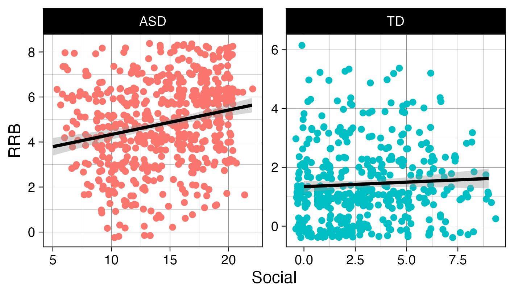

The next two weeks (no meetings next week since it is Thanksgiving week), we will focus on two key foundations from *R for Data Science*: tidying data and importing it into R. We begin with data tidying from **Chapter 5**, where you will learn the principles of tidy data — each variable in its own column, each observation in its own row — and practice reshaping datasets using tools like `pivot_longer()` and `pivot_wider()`. We then move to data import from **Chapter 7**, exploring the readr package and its fast, predictable functions for reading common file formats, specifying column types, and handling irregularities in raw data. Together, these chapters build your ability to bring data into R and prepare it for effective analysis.

One difference this time is that we will not go through the exercises in the book. The chapters we will read include few exercises, and it is important that you practice data tidying and data import in ways that reflect real-world situations you may encounter when working with data at Marcus and in other scenarios. Therefore, we have prepared custom exercises, which you will find at the bottom of this page.

The following order of activities is recommended:

**Step 1: Book chapter reading.** Read both [chapter 5](https://r4ds.hadley.nz/data-tidy.html){target="_blank"} and [chapter 7](https://r4ds.hadley.nz/data-import.html){target="_blank"} in the R for Data Science book. Skip the exercises entirely.

**Step 2: Interactive tutorials.** Go through the *r4ds.tutorials: 05-data-tidying* and *r4ds.tutorials: 07-data-import* tutorials.

**Step 3: Complete exercises.** There are eight exercises further down on this webpage. Please complete these exercises *instead* of the ones in the book.

**Step 3.5: One-on-one meetings.** We will not meet during Thanksgiving week, but please schedule a meeting with Hasse for Monday, December 1. If there are things you would like to discuss before then, feel free to schedule a meeting at any time.

**Step 4: Send Answers.** Send Hasse both HTML files (2) containing the tutorial exercise answers, as well as the R script file with the website exercise answers, via Slack no later than the end of the day on Tuesday, December 2.

**Step 5: Wednesday group discussion.**

\
\

**EXERCISES**

1.  Copy the code in the code chunk below and fill in the blanks so that it generates the plot below this chunk. Explain why we need to use `pivot_longer()` in this case (Hint: think about how `facet_wrap()` works and [this visualization](https://haswal.github.io/pivot/){target="_blank"} might help you understand the mechanics of `pivot_longer()` better). What does the `scale` argument in `facet_wrap()` do? How can you use `labs()` to remove a specific label (x-axis for example)?

```{r}
#| eval: false 
library(tidyverse)
library(palmerpenguins)

penguins |> 
  pivot_longer(cols = c(_____, _____, _____),
               names_to = _____,
               values_to = _____) |> 
  ggplot(aes(y = _____,
             x = _____, 
             fill = _____)) +
  geom_boxplot() +
  facet_wrap(~_____, scale = _____) +
  labs(x = _____)
```

```{r}
#| echo: false 
#| warning: false
#| fig-width: 8.5
#| fig-height: 3

library(tidyverse)
library(palmerpenguins)

penguins |> 
  pivot_longer(cols = c(bill_length_mm, body_mass_g, flipper_length_mm),
               names_to = "measure",
               values_to = "values") |>
  ggplot(aes(y = values,
             x = species, 
             fill = species)) +
  geom_boxplot() +
  facet_wrap(~measure, scale = "free") +
  labs(x = NULL)
```

2.  Based on the same logic as in Exercise 1, recreate the code to generate the plot below (using the `flights` data from the `nycflights13` package). How can you tell `geom_boxplot()` to remove outliers? What conclusions can you draw from the plot?

```{r}
#| echo: false 
#| warning: false
#| fig-width: 8.5
#| fig-height: 3

library(nycflights13)

flights |> 
  pivot_longer(cols = c(dep_delay, arr_delay),
               names_to = "type",
               values_to = "delay") |>
  ggplot(aes(y = delay,
             x = carrier)) +
  geom_boxplot(outliers = FALSE) +
  facet_wrap(~type)
```

3.  Copy the code in the chunk below and run it in RStudio to generate the `ex3` object. Then use `pivot_wider()` and `write_csv()` to write a file that looks like `output1.csv` (shared on Slack).

```{r}
#| eval: false 
ex3 <- tibble(column = rep(c("x", "y", "z"), each = 10), 
              values = c(4.2, 5.1, 7.1, 2.1, 7.2, 8.1, 2.2, 8.2, 9.1, 10,
                         7.3, 7.4, 8.3, 9.2, 2.3, 1.2, 8.5, 9.4, 12.4, 1.5,
                         8.9, 2.7, 1.4, 7.7, 3.4, 8.7, 9.5, 0.8, 2.9, 9.9),
              ID = rep(paste0("ID_", 1:10), 3))
```

4.  Next, we will practice importing some data. This exercise makes use of the `example1.csv` file sent to you on slack. It is recommended that you first take a look at the file (in the TextEdit app for example) before attempting to read it in, in order to identify things such as how columns are separated and how missing values are coded. Fill in the blanks in the code so that the output ends up looking identical to the tibble shown in next code chunk. Note that you may have to install the `janitor` package first. What does the `::` notation after `janitor` indicate?

```{r}
#| eval: false 
#| warning: false

example_1 <- read_csv(_____, skip = __, na = _____)
 
example_1 |>
  janitor::_____ |> 
  mutate(measure_1 = parse_number(_____), 
         age = parse_number(if_else(age == _____, _____, _____)))
```

```{r}
#| echo: false 
#| warning: false

read_csv("Session-3_files/example1.csv", skip = 2, na = "missing") |>
  janitor::clean_names() %>% 
  mutate(measure_1 = parse_number(measure_1), 
         age = parse_number(if_else(age == "eleven", "11", age)))
```

5.  We will continue with `example2.csv`. Now it is your job to figure out how this file should be read and if any data transformation is necessary. Carefully study the file and look for ways to determine the correct `read_*()` function, meta-data lines, data entry inconsistencies and missing values. After reading in and transforming the data, make the plot below. The same color scale as in the very first example in [chapter 1](https://r4ds.hadley.nz/data-visualize.html){target="_blank"} of *R for Data Science* is used here. Read [this article](https://ggplot2.tidyverse.org/reference/ggtheme.html){target="_blank"} about how to change the *theme* (for example the default grey background). What should the `method` argument in `geom_smooth()` be set to for the curves to look like in the plot? Can you spot any issues with the way the curves fit the data, considering the y-axis represents the number of eggs?

```{r}
#| echo: false 
#| warning: false
#| fig-width: 6.5
#| fig-height: 4.5
#| fig-align: center
read_csv2("Session-3_files/example2.csv", 
          na = c("-99", "eggs not counted"),
          col_names = c("ID", "age_in_days", "number_eggs"),
          skip = 4) %>% 
  mutate(ID = if_else(ID == "ID_number_2", "ID_2", ID)) %>% 
ggplot(aes(x = age_in_days, 
           y = number_eggs)) +
  geom_smooth(aes(color = ID), 
              se = FALSE, 
              method = "gam") +
  ggthemes::scale_color_colorblind() +
  theme_bw() +
  labs(title = "Medflies (Ceratitis capitata)",
       subtitle = "Eggs laid during the first 25 days", 
       caption = "Data from Carey et al. 1998")
```

For the next exercises, you will work with real data from Marcus (sent via Slack). These exercises use two datasets from clinical researchers studying the Autism Diagnostic Observation Scale (ADOS). Your task is to help these researchers tidy and manipulate their data so that visualizing it and creating summaries becomes a straightforward process.

6.  First, we have the `ADOS1.xlsx` dataset. The researcher responsible for this data collection was interested in participants’ scores on the Social Affect subscale and how they vary over time. One new column was added for each participant assessed, reflecting all ages at which participants came to the clinic, inputting their Social Affect score on the row corresponding with their age at that clinic visit (we know, not a great way to input data!). As you will see, this dataset contains many missing values, as it would be quite unrealistic for all participants to visit at all ages.

    Note that the data is stored in an Excel file. To be able to import the file, first load the `readxl` package (already installed with the tidyverse collection of packages), then use the `read_xlsx()` function. Continue with one of the `pivot_*()` functions to properly format the ADOS1 dataset so you are able to calculate the *average number of visits across all participants*. To do this, we want you to use the `count()`, and `summarize()` functions. How many participants visited the clinic two or more times?

7.  Next, we have `ADOS2.xlsx`, created by a researcher who only recorded data from a single visit for each participant. This single visit, however, is reflected across two different rows, as a new row was created when scoring each subscale.

    Import the data correctly (how are NAs coded for example?) and use one of the `pivot_*()` functions to properly format the ADOS2 dataset so you are able to recreate the plot below. Take a look at the x- and y-axis labels for a hint as to the variables you may need to create. Read about how to jitter points [here](https://www.statology.org/ggplot-jitter/){target="_blank"}.

<center>



</center>

8.  Here you will get to practice creating a summary table from a dataset that closely mimics real world *First Focus* data, stored in the `advanced_pivot.csv` file. The data entry process produced a dataset where each row represents a participant (identified in the `PID` column), and each subsequent column contains assessments of communication (Com), gross motor (GM), and fine motor (FM) skills at 6, 12, and 18 months. As you will see, the assessment type and age are both stored in the column names, making this a pivot problem very similar to example 5.3.4 in *R for Data science*. First read in the data, then use a combination of `pivot_longer()`, `pivot_longer()` (yes, you will need to pivot twice), `group_by()` and `summarize()` (and perhaps another function or two to get everything just right) to generate this output:

```{r}
#| echo: false 
#| warning: false
advanced_pivot <- read_csv("Session-3_files/advanced_pivot.csv", 
                             skip = 5, 
                             na = "missing")

advanced_pivot %>% 
  pivot_longer(cols = !PID,
               names_to = c(".value", "age"),
               names_sep = "_") %>% 
  pivot_longer(cols = 3:5,
               names_to = "measure",
               values_to = "values") %>% 
  mutate(age = parse_integer(age)) %>% 
  group_by(age, measure) %>% 
  summarize(mean_values = mean(values, na.rm = TRUE), .groups = "drop")

```
