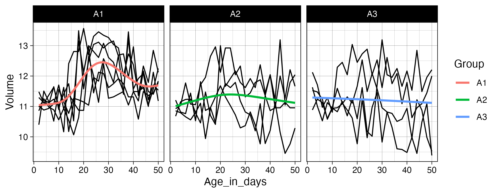

We have now covered the basics of using R and the tidyverse to work with data, meaning we’ve completed the chapters in the *Whole Game* section of *R for Data Science*. This first part of the book provides an overview of the core tools of data science — just enough of each major component to let you work with real datasets. Subsequent chapters examine these topics in greater detail, and although reading all (or at least most) of them is beneficial, we will not delve deeply into all of these areas during the training. This will allow us to move on to the statistics portion of the program in a timely manner.

In addition to giving you the foundation needed for the statistics training to make sense, we want to ensure you have the practical skills required to address the data-science challenges you may encounter while working at Marcus. Therefore, over the next two weeks you will focus on two topics we know you will rely on when working with data collected at the center (and elsewhere): cleaning strings using regular expressions and combining datasets using join functions. **Chapter 15** introduces regular expressions as a tool for cleaning, searching, and extracting information from text using `stringr` functions such as `str_detect()`, `str_extract()`, and `str_replace()`. **Chapter 19** covers how to combine datasets with `dplyr` joins, explaining key join types like `left_join()` and `inner_join()` and how table keys determine how data is matched and merged.

Since these two topics are both a bit dense and related, and because exercises that draw on methods from both chapters provide the most effective practice, you will have two weeks to work through the materials. 

As with the previous sections, we won’t rely on the book’s exercises. Instead, we provide custom exercises below, tailored to give you practice with scenarios similar to ones you are likely to face when working with real-world data. 

**Step 1: Book chapter reading.** Read both [chapter 15](https://r4ds.hadley.nz/regexps.html){target="_blank"} and [chapter 19](https://r4ds.hadley.nz/joins.html){target="_blank"} in the R for Data Science book. **Important:** we will not read the full chapters, as the later sections of both become somewhat esoteric and less relevant for day-to-day data-science work. Instead, focus on sub-chapters **15.1–15.4** and **19.1–19.4**. This also means you only need to complete the corresponding portions of the tutorials (more on that below). Skip the book chapter exercises. 

**Step 2: Interactive tutorials.** Go through the r4ds.tutorials: *15-regular-expressions* tutorial, but as mentioned already, you do not need to complete all exercises. We will focus on the exercises that correspond to the sub-chapters listed above, which means the final exercise you need to complete in the regular expressions tutorial is exercise 11 in the *Pattern Details* section. For the *r4ds.tutorials: 19-joins* tutorial, the last exercise you need to complete is exercise 2 in the *Filtering Joins* section. Even though you will skip some exercises, make sure to visit the *Download answers* section and save the HTML output. 

**Step 3: Complete exercises.** You will find a fairly large number of exercises later on this page. Please complete these instead of the exercises in the book. They will take some time, and this is the main reason we are giving you two weeks to complete everything. 

**Step 3.5: One-on-one meetings.** Let's aim to meet on Monday, December 15. Remember you can schedule a meeting with Hasse at any time, if you need help with exercises or want to talk about something else (it doesn't even have to be completely R related!).

**Step 4: Send Answers.** Send Hasse the two HTML files with your tutorial answers and the R script with your website exercise answers via Slack by the end of the day on Tuesday, December 16.

**Step 5: Wednesday group discussion.** The next group meeting will be on December 17. 

\
\


**EXERCISES**

1. We’ll begin with some basic string-processing exercises using datasets you are familiar with by now: `babynames` and data from the `nycflights13` package. In the exercises below, use `filter()` and `str_detect()` to extract strings that match specific patterns. Keep in mind that most questions can be solved in multiple ways, and it is good practice to see if you can find more than one solution. 

    We will start simple with a couple of exercises using *literal characters* (letters and numbers that match contents of strings exactly).

a. Find all names in the `babynames` data that contain a `z`. Are there any duplicated names in the output? How many unique names include a `z`? How does this number change if you take both upper- and lowercase letters into account, for example by first converting all characters in the names to lowercase? How many names contain a `z` followed by another `z`? How about a `z` followed by a `y`? 

b. In the `nycflights13::planes` data, find all planes with a tail number (`tailnum`) containing a `5`. How many of these also have a `B` in the `tailnum`? How many planes have a `tailnum` with a `5` followed by a `B`? How about a `B` followed by a `5`?

    Next, we turn to *metacharacters*, regular expression characters with special meaning. One of the most used metacharacters is `.`, a so called wildcard character that matches any single character. We will practice using this character below.
    
c. In the `babynames` data, find all names with a `y` followed by any other letter. Next, find all names with a `z` followed by two letters of any type and then a `y`. Then, find all names containing a `z` that is both preceded and followed by four letters of any type. Finally, find all names with a `z` followed by a `y` and then three additional letters of any kind.

    *Quantifiers* are metacharacters controlling how many times a pattern can match. Commonly used quantifiers are:  `?`, `+` and `*`.
    
d. Explain the difference in output between these two pipes:

```{r}
#| eval: false
babynames |>
  filter(str_detect(name, "zz?y")) |> 
  distinct(name)

babynames |>
  filter(str_detect(name, "zz+y")) |> 
  distinct(name)
```

e. Explain why these three pipes return different numbers of planes: 
```{r}
#| eval: false
nycflights13::planes |> 
  filter(str_detect(tailnum, "N11?0"))

nycflights13::planes |>  
  filter(str_detect(tailnum, "N11+0"))

nycflights13::planes |> 
  filter(str_detect(tailnum, "N11*0"))
```

f. We can also use the `{n}`, `{n,}`, and `{n,m}` quantifier notations to match exactly `n` times, at least `n` times, or between `n` and `m` times, respectively. Use these methods to find all planes with a tail number containing four consecutive `8`s, at least two `9`s, or between one and three `5`s. 

g. You may assume that one could use code like `str_detect(name, ".{5}")` to find all baby names with exactly five letters. Try it out and see if this works as expected. The reason this may produce somewhat surprising results is that we have not specified *where* in the name string we want to match five letters; as a result, any name with *at least* five letters will be matched. Here, *anchors* are useful: `^` matches the start of a string, and `$` matches the end. Now, use anchors and quantifiers to find all names with exactly 10 letters. Next, find all names with between 13 and 16 letters. How many names start with two `a`s (don't forget to account for upper- and lowercase letters)? How many names start with an `S`, end with a `y`, and contain exactly 7 letters in total?     

    Next, we move on to *character classes*, which allow you to match any character in a set using `[]`. For example, to match the letters `x`, `y`, or `z`, you can use `[xyz]`. Inside `[]`, you can also specify a range using `-`, so that `[a-z]` matches any lowercase letter.

h. Find all baby names starting with `X`, `Y`, or `Z`. How many of these names end with an `e` or `y`? Next, find all names starting with a vowel. How many of these names contain 10 or more letters? How many names start with four consecutive vowels? Are there any names containing only vowels? Are there any names containing only consonants?

2. Now use your data science skills and the `babynames` data to investigate a naming trend over time that you find interesting. Calculate both the *proportion of names* that match a certain pattern each year and the *proportion of babies* (taking the `n` column into account by for example using the `weighted.mean()` function) with a name matching that pattern. Plot the results.   

3. There are many game type versions of regex learning tools available online. Go through the regex crossword tutorial found [here](https://regexcrossword.com/tutorial/1){target="_blank"} (5 exercises) and then solve the beginner crosswords at [https://regexcrossword.com/challenges/beginner](https://regexcrossword.com/challenges/beginner){target="_blank"}. 

  * The crosswords introduced a regular expression of the type `(A)\1`, known as a *back reference*, which means that whatever is inside the parentheses is repeated. You can read more about this in sub-chapter 15.4.6 of *R for Data Science*. Based on how back references work, explain what the code below does.
   
```{r}
#| eval: false
babynames %>% 
  filter(str_detect(name, "([^aeiou])\\1")) |> 
  distinct(name)
```

  * In `nycflights13::planes`, can you find all tail numbers with four consecutively identical numbers? (Hint: use `{}` after `\\1`).

   
4. Use `str_count()` with the `nycflights13::airports` data to find all airport names with five or more "words" in the name. (Hint: match whitespace as described in 15.4.3). How many of these have a single letter within their name? 

5. The names of the airports in `nycflights13::airports` contain some inconsistencies. For example, `Regional` is sometimes spelled as `Regl`, `Reg'l`, or `Rgnl`. Use `mutate()` and `str_replace()` to change all of these alternative spellings to `Regional`. How many airports contain `Regional` in their name before and after applying `str_replace()`?

    How many airport names end with a `.`? Use `str_remove()` to remove the period in these cases. 

6. Use `mutate()` and `str_extract()` to create a variable returning only the first letter of each name in `babynames`. Grouping by this new variable, calculate the sum of babies given a name beginning with each letter (you can ignore any time trends). Plot these frequencies as a bar graph (using `geom_col()` as described [here](https://www.datanovia.com/en/lessons/ggplot-barplot/){target="_blank"}). What is the most frequent first letter? Find the top three names starting with this letter.

7. Aiden and Sarah have given us a real data example from the neuro-imaging lab to practice some string cleaning. The data will be sent via Slack (`PNC_ScanIDs_r4dss.xlsx`). Your job is to do two things: first make edits so that all digit parts of the IDs are separated by the same type of character. Second, some IDs have a four digit time tag. Please remove this tag so that the IDs become more consistent.

8. To practice using the different `*_join()` functions we will use a small example of a customer database. We will focus on two tables: *orders* which contains the order number, customer ID, and date of the order; and *customers* which contains the customer ID and customer name. These data can be generated using the code below. 

```{r}
#| eval: false
orders <- tibble::tribble(
  ~order,  ~id,     ~date,
       1,    4,  "Jan-01",
       2,    8,  "Feb-01",
       3,   42,  "Apr-15",
       4,   50,  "Apr-17",
       5,    8,  "Apr-21"
)

customers <- tibble::tribble(
  ~id,     ~name,
    4,   "Tukey",
    8, "Wickham",
   15,   "Mason",
   16,  "Jordan",
   23,   "Patil",
   42,     "Cox"
)
```

a. Join the two datasets, keeping all observations from the `orders` data. You may notice that one of the IDs in `orders` is duplicated. How does `join` handle a duplicate key in this situation? Explain any `NA` values that appear in the output. 

b. Join the two datasets, ensuring that no observations are dropped. 

c. Which of the `*_join()` functions would you use to find the the IDs that are included in both datasets? 

d. Use `anti_join()` to find the customers who do not have any orders in `orders`. 

9. There may be cases where you are attempting to load in data from a messy directory with files with an assortment of extensions. It is often useful to filter those files to return only, say, .csv files or .tif files, depending on the application. In the code below we provide a list of file names in a tibble. Run the code to generate `df_files`. Extract only `.csv` files. Create a new variable containing the *participant ID* as a numeric value (e.g., `"sub001" -> 1`). Do the same for *session number*. Finally, join `df_files` and `groups` keeping all observations in `df_files`. 

```{r}
#| eval: false
df_files <- tibble(files = c(
  "sub001_session1.csv", "subb002_session2.csv", 
  "notes.txt", "sub003_session1.csv", "README.md","sub004_session1.csv",
  "sub005_session2.csv","suub006_session2.csv")
)

groups <- tibble(ID = c(1, 2, 3, 4, 6, 7, 8), 
                 Group = c("group_2", "group_2", "group_1",
                           "group_1", "group_2", "group_2", "group_1"))
```

10. We are going to work with two datasets from Marcus: one containing ADOS-derived classifications and one with subsequent clinician’s best estimates (CBEs) of diagnostic outcome. These data can be found in the `ADOS_rj.xlsx` and `CBE_rj.xlsx` files shared on Slack.

a. Start by importing the two files. Identify the individual identifiers in both datasets and, if necessary, edit the ID strings so that they can be used for downstream joins. 

b. Let’s evaluate how our data sets overlap. Use the `inner_join()` function to identify all of the participants found in both the ADOS data and the CBE data. How many of these individuals have more than one observation in the data? Use the `distinct()` function to remove duplicated obs so that you get an accurate count of the number of individuals in the ADOS data that are also in the CBE data.

c. Next, remove all individuals with a CBE of developmental delay ("dev-delay") from your ADOS data set. To do so, first use `filter()` to keep only individuals with a CBE of "dev-delay" and create an object called `CBE_dev_delay` that stores these individuals. Then, use `anti_join()` to return the ADOS data set without any of the individuals in CBE_dev_delay. How do the mean `Social` and `RRB` subscale scores change when you calculate them with versus without individuals who later received a CBE of developmental delay?

11.  We would now like you to try joining information from data separated across three different files. In this scenario, we use a toy dataset inspired by a real-world situation of combining raw eye-tracking data from the eye-tracker at FERN with viewed movie clip and session number information pulled from metadata exported after each scan. 
Read in `asd_stats-ET.xlsx` (containing x and y points of regard [x pos/y pos], the block number and participant ID), `block_movie-correspondence.xlsx` (which movie is viewed per block) and `block_session-sequence.xlsx` (which blocks were viewed per session per participant). Ensure any metadata lines are skipped during import and, using a technique you learned in the previous class, clean the column names by handling spaces and uppercase characters. Try to remove the `DEX:`/`DEX-` prefix from each subject ID using `str_replace()` or `str_remove()`. The goal will be to create one super-tibble containing participant ID, block and session number, movie viewed and the coordinate data. You will need to perform two successive joins. Think about the keys you will require for each join to ensure unique rows are matched. Finally, use `geom_point` and facet wrap to have separate plots per movie, overlaying each participants' points of regard per movie. If matched correctly, you should see similar patterns of viewing within each movie.   

12. The zipped directory `Exercise_12.zip` contains several files that we want you to import, clean, join, transform, and plot. Start by importing all `.csv` files following the instructions in Chapter 7.4 of *R for Data Science*. The participant ID is stored somewhere in each filename, so remember to set the `id =` argument in `read_csv()` so the filenames are included in the resulting tibble. Next, extract the ID portion from the filenames (hint: check `groups.xlsx` to see how the IDs are coded) and store this in a new variable. Then work through the steps needed to add the group information to the Age/Volume data. Finally, pivot and transform the data so that you can create the plot shown below. Use `geom_line(aes(group = ID))` to draw a separate black line for each participant. 

<center>

{width=90%}

</center>
 